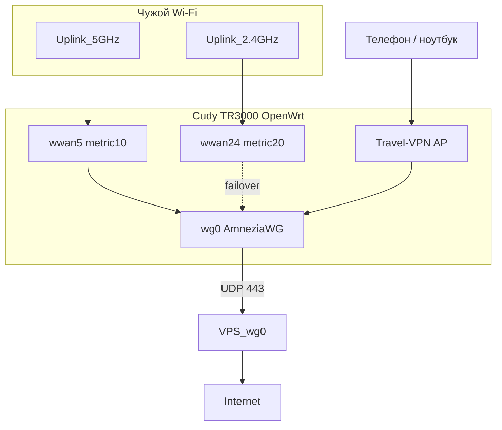

# Cudy TR3000 + AmneziaWG на своём VPS

Портативный VPN-шлюз: **Cudy TR3000** подключается к чужому Wi‑Fi (WISP), поднимает **AmneziaWG** до вашего **VPS за пределами РФ**, раздаёт Wi‑Fi клиентам с выходом только через туннель (kill-switch).

Готовой «прошивки одним файлом» в репозитории нет: путь = официальный OpenWrt + модуль ядра + скрипты из этого репо.

## Схема



| Узел | По умолчанию | Роль |
|------|----------------|------|
| VPS `wg0` | `10.9.0.1/24` | AmneziaWG-сервер, NAT в интернет |
| Cudy `wg0` | `10.9.0.2/24` | единственный пир в этом гайде |
| Cudy LAN | `192.168.10.1` | DHCP для кабеля и AP |
| WISP | `wwan5` + `wwan24` | Два uplink; failover, не суммирование скорости |

## Документация (под ключ)

| Шаг | Файл |
|-----|------|
| 1. Что умеет шлюз | [docs/01-overview.md](docs/01-overview.md) |
| 2. Прошить Cudy → OpenWrt | [docs/02-flash-cudy.md](docs/02-flash-cudy.md) |
| 3. Поднять AmneziaWG на VPS | [docs/03-vps-amneziawg.md](docs/03-vps-amneziawg.md) |
| 4. Связать Cudy с VPS | [docs/04-connect-cudy.md](docs/04-connect-cudy.md) |
| 5. Смена uplink Wi‑Fi | [docs/05-switch-wifi.md](docs/05-switch-wifi.md) |

## Быстрый порядок

1. Прошить **Cudy TR3000 EU v1** (не 256 МБ): intermediate → OpenWrt **24.10.5+** → LAN `192.168.10.1`.
2. На **VPS** (Ubuntu/Debian): `scripts/vps/awg-server.sh` с `CLIENT_PUB` с роутера.
3. На **Cudy**: собрать/скопировать `amneziawg.ko`, `setup-wisp.sh`, `awg-apply.sh`, LuCI «Смена Wi‑Fi».
4. Проверка: `EXPECTED_IP=VPS_IP sh scripts/router/verify-awg.sh`.

Переменные: `scripts/router/router.env.example`, `scripts/vps/awg-params.env.example`.

## Состав репозитория

```
scripts/vps/          — сервер AmneziaWG
scripts/router/       — WISP, клиент AWG, hotplug, сборка kmod
scripts/luci-wisp/    — страница «Смена Wi‑Fi»
artifacts/            — откуда качать OpenWrt, куда класть .ko
```

## Железо

- **Cudy TR3000 EU v1.0**, 128 МБ — target `cudy_tr3000-v1`
- Для партий с новым флешем нужен OpenWrt **24.10.5 или новее** (см. док прошивки)

## Лицензия

MIT — см. [LICENSE](LICENSE).
